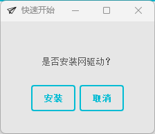
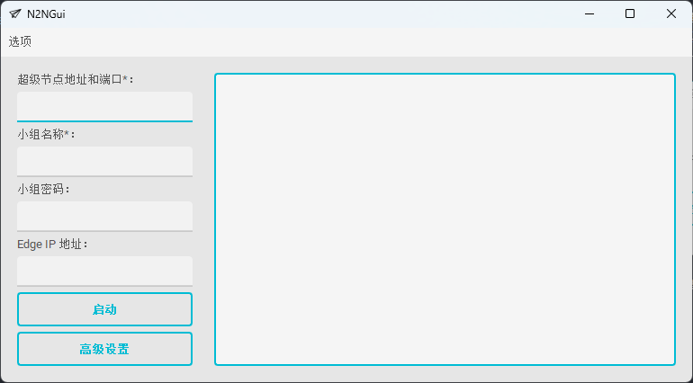
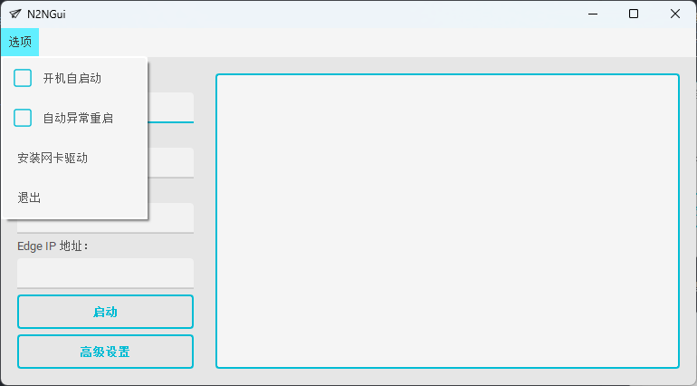

# N2NGui

[English](./README.md)
[中文](./README.zh-CN.md)

基于N2N Edge开发的Window客户端，用于内网穿透

## 快速开始

1. 下载并解压N2NGui.zip到空文件夹下
2. 首次请以``管理员身份``启动
3. 安装网卡驱动(非必须)

4. 填写N2N启动参数

5. 其他选项

## 开发者

### TODO

+ 国际化
+ ...

### 编译

1. 运行``package.py``

## 许可证

[MIT](./LICENSE)